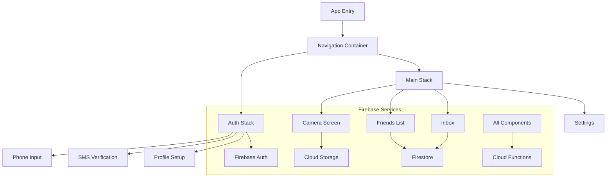
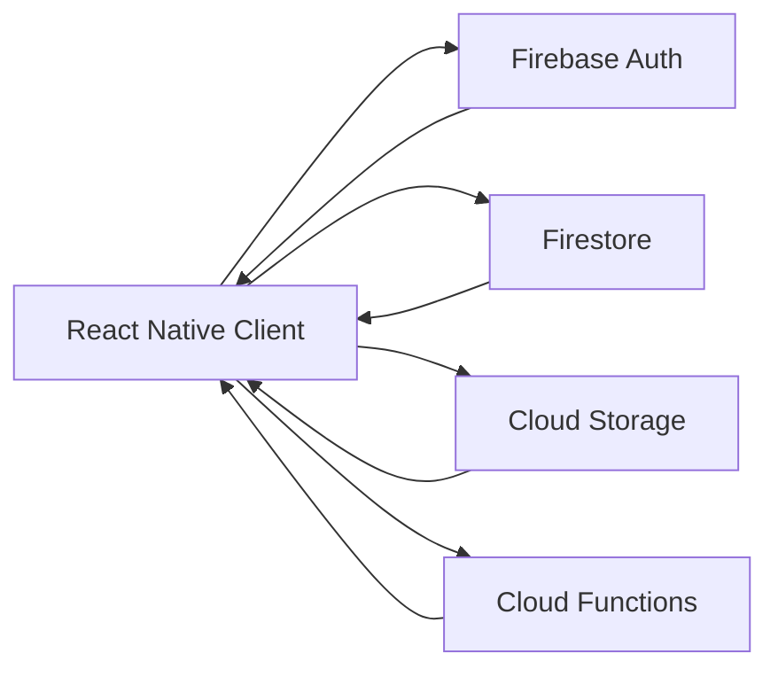

# System Patterns

## Project Structure
```
snapConnect/
├── src/                    # Source code directory
│   └── services/          # Service layer
│       └── firebase/      # Firebase services
│           ├── auth.ts    # Authentication service
│           ├── config.ts  # Firebase configuration
│           └── init.ts    # Firebase initialization
├── android/               # Android native code
├── ios/                   # iOS native code
├── assets/               # Static assets
└── App.tsx               # Root component
```

## Architecture Patterns
1. Service Layer Pattern
   - Firebase services are isolated in the services directory
   - Each Firebase feature has its own service module

2. Initialization Pattern
   - Firebase is initialized at app startup
   - Services are initialized in a specific order
   - Configuration is separated from initialization logic

3. Authentication Flow
   - Firebase Authentication handles user management
   - Auth state is managed through Firebase Auth service
   - Auth persistence is configured for mobile environment

## Design Patterns
1. Module Pattern
   - Each Firebase service is a separate module
   - Clear separation of concerns between services

2. Configuration Pattern
   - Environment-specific configuration in separate files
   - Secure handling of API keys and credentials

3. Initialization Pattern
   - Lazy loading of Firebase services
   - Services are initialized only when needed

## Best Practices
1. Firebase Integration
   - Use modular API (v9+)
   - Proper error handling
   - Secure configuration management

2. React Native
   - Component-based architecture
   - TypeScript for type safety
   - Proper navigation structure

3. Mobile Development
   - Platform-specific considerations
   - Performance optimization
   - Security best practices

# SnapConnect System Patterns

## Architecture Overview

### Frontend Architecture


### Data Flow


## Design Patterns

### State Management
- Firebase Authentication for user state
- Firestore listeners for real-time updates
- Context API for app-wide state
- Local storage for user preferences

### Component Patterns
1. Screen Components
   - Handle navigation logic
   - Manage screen-level state
   - Coordinate child components

2. Feature Components
   - Implement specific features
   - Handle business logic
   - Manage feature-specific state

3. UI Components
   - Reusable UI elements
   - Style consistency
   - Platform-specific adaptations

### Firebase Integration Patterns
1. Authentication
   - Phone number verification
   - JWT token management
   - Session persistence
   - Auto token refresh

2. Firestore
   - Collection structure
   - Real-time listeners
   - Offline persistence
   - Batch operations

3. Cloud Storage
   - Media upload/download
   - Progress tracking
   - Cache management
   - Automatic cleanup

4. Cloud Functions
   - HTTP triggers
   - Firestore triggers
   - Storage triggers
   - Scheduled tasks

## Directory Structure
```
src/
├── components/
│   ├── screens/       # Screen components
│   ├── features/      # Feature-specific components
│   └── ui/            # Reusable UI components
├── navigation/        # Navigation configuration
├── services/
│   ├── firebase/     # Firebase service wrappers
│   ├── storage/      # Local storage utilities
│   └── api/          # API utilities
├── hooks/            # Custom React hooks
├── utils/            # Utility functions
├── types/            # TypeScript definitions
└── theme/            # Styling and theme

functions/
├── src/
│   ├── auth/         # Authentication functions
│   ├── media/        # Media processing functions
│   ├── notifications/# Notification functions
│   └── triggers/     # Firestore & Storage triggers
└── types/            # Shared TypeScript types
```

## Security Patterns
1. Authentication
   - Phone verification
   - Session management
   - Token refresh
   - Device tracking

2. Firestore Rules
   - User-based access
   - Role-based access
   - Data validation
   - Rate limiting

3. Storage Rules
   - File type validation
   - Size limits
   - User quotas
   - Path-based access

## Error Handling
1. Network Errors
   - Retry mechanisms
   - Offline support
   - User feedback
   - Error logging

2. Firebase Errors
   - Authentication errors
   - Permission denied
   - Quota exceeded
   - Service unavailable

3. Media Errors
   - Upload failures
   - Processing errors
   - Storage limits
   - Format issues

## Performance Patterns
1. Firebase Optimization
   - Query optimization
   - Index management
   - Batch operations
   - Cache strategies

2. Media Handling
   - Client-side compression
   - Progressive loading
   - Caching strategy
   - Background uploads

3. Real-time Updates
   - Listener management
   - Data pagination
   - Throttling
   - Connection state

## Testing Patterns
1. Unit Tests
   - Component testing
   - Hook testing
   - Utility testing
   - Firebase mocking

2. Integration Tests
   - Firebase integration
   - Navigation flows
   - API integration
   - Error scenarios

3. E2E Tests
   - User flows
   - Firebase operations
   - Media handling
   - Offline behavior

## Monitoring
1. Firebase Analytics
   - User engagement
   - Feature usage
   - Error tracking
   - Performance metrics

2. Error Reporting
   - Crash reporting
   - Error logging
   - User feedback
   - Debug information

3. Performance Monitoring
   - Load times
   - API latency
   - Storage usage
   - Function execution 